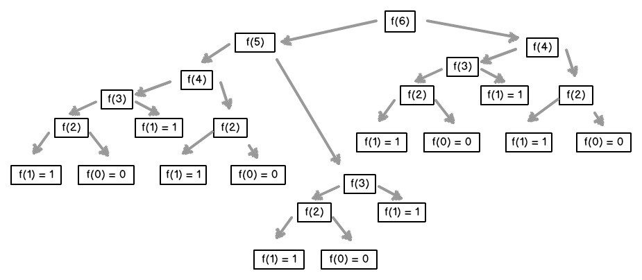
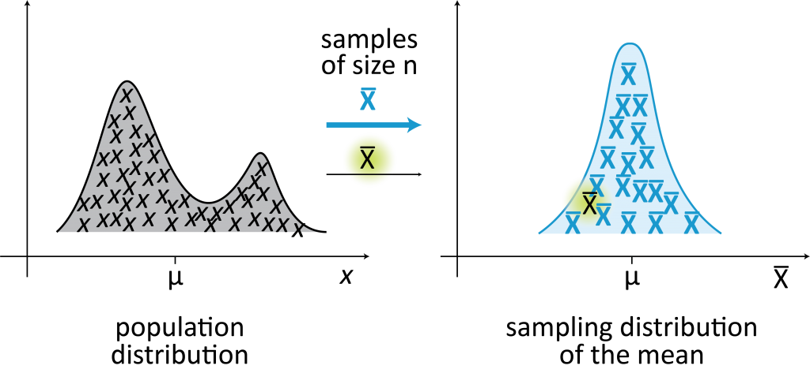

<div align="center">
    <h1>Computational statistics with python</h1>
</div>


<div align="center"> 
  
</div>


The content of this document is based on the course of the same name taught by [David Aroesti](https://github.com/jdaroesti) on [Platzi](https://platzi.com/r/michel_brmdz/).

# Table of contents
- [Course objectives](#Objectives)
- [Dynamic Programming](#Dynamic-Programming)
    - [Introduction to dynamic programming](#Introduction-to-dynamic-programming)
    - [Fibonacci optimization](#Fibonacci-optimization)
- [Random Paths](#Random-Paths)
    - [What are random paths?](#What-are-random-paths?)
- [Stochastic Programs](#Stochastic-Programs)
    - [Introduction to Stochastic Programming](#Introduction-to-Stochastic-Programming)
    - [Probability calculation](#Probability-calculation)
    - [Statistical inference](#Statistical-inference)
    - [Mean](#Mean)
    - [Variance and Standard Deviation](#Variance-and-Standard-Deviation)
    - [Normal Distribution](#Normal-Distribution)
- [Monte Carlo simulations](#Monte-Carlo-simulations)
    - [What are Monte Carlo Simulations?](#What-are-Monte-Carlo-Simulations?)
- [Sampling and Confidence Intervals](#Sampling-and-Confidence-Intervals)
    - [Sampling](#Sampling)
    - [Central limit theorem](#Central-limit-theorem)
- [Experimental Data](#Experimental-Data)
    - [How to work with experimental data?](#How-to-work-with-experimental-data?)
    - [Linear regression](#Linear-regression)

# Objectives
- Learn when to use dynamic programming and its benefits.
- Understand the difference between deterministic and stochastic programs.
- Learn to use Stochastic Programming.
- Learn to create valid computer simulations.

# Dynamic Programming

## Introduction to dynamic programming

<div align="center"> 
  
  <p>Richard Bellman</p>
</div>

In the 1950s, Richard Bellman needed government funding to continue his research, so he needed a bombastic name so they wouldn't be able to reject his application, so he chose **dynamic programming**. Bellman's own words were:
_"[The name] Dynamic Programming was chosen to hide the fact that he was actually doing Math from government sponsors. The phrase Dynamic Programming is something no congressman can object to."_ - Richard Bellman.

Knowing that **Dynamic Programming** is not related to its name, the truth is that it is one of the most powerful techniques to optimize certain types of problems.

The problems that you can optimize are those that have an **optimal substructure**, this means that a **global optimal solution** can be found by combining **optimal solutions of local subproblems.**

We can also find **spliced problems**, which involve solving the same problem several times to find an optimal solution. 


One technique to obtain high speed in our program is **Memorization**, which consists of saving previous computations and avoiding doing them again. Normally a dictionary is used, where the queries can be made in `O (1)`, and for this we make a change of _time by space._ 

## Fibonacci optimization

_Fibonacci_ series is represented as `Fn Fn = Fn-1 +-2` and is very simple to implement in code recursively. However, it is very inefficient to simply do it recursively, since we repeat the same computation several times.

<div align="center"> 
  
  <p>Fibonacci algorithm</p>
</div>

If you look at the image you will notice that we repeat the calculation several times for `f (4), f (3), f (2), f (1) and f (0)`, this means that our algorithm grows from form **exponential** `O (2 ^ n)`.

To optimize our algorithm we will first implement the **recursive function** and then give way to **memorization**, with this the improvements will be really surprising.


# Random Paths

## What are random paths?

**Random paths** are a type of simulation that randomly chooses a decision from a set of valid decisions. It is used in many fields of knowledge when systems **are not deterministic** and include **elements of randomness**.


# Stochastic Programs

## Introduction to Stochastic Programming

A program is **deterministic** when it is run with the same _input_ it produces the same _output_. **Deterministic** programs are very important, but there are problems that cannot be solved that way.

The **stochastic programming** allows us to introduce randomness to our programs to create simulations that allow us to solve other types of problems. **Stochastic programs** take advantage of the fact that the **probability distributions** of a problem are known or can be estimated.

## Probability calculation

The **probability** is a measure of the certainty associated with a future event or event and is usually expressed as a number between 0 and 1. A **probability** of 0 means that an event will never happen, and in its counterpart a **probability** of 1 means that it is guaranteed to happen.

When talking about **probability** we ask what fraction of all possible events the property we are looking for has, that is why it is important to be able to calculate all the possibilities of an event to understand its probability. The probability that an **event happens** and that **does not happen** is always **1**.

- Complement rule:
    - P(A) + P(~A) = 1

- Multiplication rule:
    - P(A y B) = P(A) * P(B)

- Addition rule:
    - Mutually exclusive: P(A o B) = P(A) + P(B)

    - Non exclusive: P(A o B) = P(A) + P(B) - P(A y B)
    


To see a practical example of the previous laws, we are going to carry out an exercise of rolling a 6-sided die:

- The probability that the number **1** will appear:
    
    We have **6** possibilities and the number **1** is one of them, so the probability is **1/6**.

- The probability that we get the number **1 or 2:**

    We have **6** possibilities and the number **1** is one of them and the **2** is another. The fact that we get a number is **mutually exclusive**, since we cannot obtain 2 numbers at the same time. Under this premise we will use the **mutually exclusive additive law.**

    `P(1 o 2) = P(1) + P(2) `

    `P(1 o 2) = 1/6 + 1/6`

    `P(1 o 2) = 2/6`

- The probability that we get the number **1** at least **1 time** in **10 tosses**:

    For each toss we have a **1/6** chance that we hit **1**, so we use the **multiplicative law**

    `(1/6)^10 = 0.8333`

## Statistical inference
With simulations we can calculate the probabilities of complex events knowing the probabilities of simple events.

What happens when we don't know the probabilities of simple events? **Statistical inference** techniques allow us to infer / conclude the properties of a population from a **random sample.**

_"The guiding principle of **statistical inference** is that a random sample tends to exhibit the same properties as the population from which it was drawn."_ - John Guttag

<div align="center"> 
  
</div>

### Law of large numbers

With the **law of large numbers** we can see that in repeated independent tests with the same probability p of an outcome, the fraction of deviations from p converges to zero as the number of tests approaches infinity.

<div align="center"> 
  
</div>

### Gambler's fallacy

The **gambler's fallacy** points out that after an extreme event, less extreme events will occur to level the mean.

The _regression to the mean_ indicates that after an extreme random event, the next event will likely be less extreme.

## Mean

The **mean** is a measure of central tendency, commonly known as the average. The mean of a population is denoted by the symbol μ and the mean of a sample is defined by X̄.

<div align="center"> 
  
</div>

One way to calculate the mean with Python would be the following.

```py
import random

def mean(X):
    return sum(X) / len(X)

if __name__ == '__main__':
    X = [random.randint(9, 12) for i in range(20)]
    mu = mean(X)

    print(f'Array X: {X}')
    print(f'Mean = {mu}')
```

## Variance and Standard Deviation

### Variance

The **variance** measures how spread out a set of random values is from its mean. While the **mean** gives us an idea of where the values are, the **variance** tells us how scattered they are. The **variance** must always be understood with respect to the mean.

<div align="center"> 
  
</div>

### Standard Deviation

The **standard deviation** is the square root of the **variance**. It also allows us to understand propagation and it must always be understood in relation to the **mean**.

The advantage over **variance** is that the standard deviation is in the same units as the **mean**.

<div align="center"> 
  
</div>

We are going to implement the **variance** and **standard deviation** functions in our ready-made script for the **mean.**

```py
import random
import math

def mean(X):
    return sum(X) / len(X)


def variance(X):
    mu = mean(X)

    collector = 0
    for x in X:
        collector += (x - mu)**2

    return collector / len(X)


def standard_deviation(X):
    return math.sqrt(variance(X))


if __name__ == '__main__':
    X = [random.randint(9, 12) for i in range(20)]
    mu = mean(X)
    Var = variance(X)
    sigma = standard_deviation(X)

    print(f'Array X: {X}')
    print(f'Mean = {mu}')
    print(f'Variance = {Var}')
    print(f'Standard deviation = {sigma}')
```

## Normal Distribution

The **normal distribution** is one of the most recurrent distributions in any field. It is fully defined by its **mean** and its **standard deviation**. It allows calculating **confidence intervals** with the empirical rule.

<div align="center"> 
  
</div>

In the following example we are going to create a distribution with standard deviation 1 and 3. When the deviation is low it means the variability of the data is less.

<div align="center"> 
  
</div>

### Empirical rule

Also known as the 68-95-99.7 rule. Indicate the dispersion of the data in a normal distribution at one, two and three sigmas.

Allows you to calculate probabilities with the density of the normal distribution.

<div align="center"> 
  
</div>

<div align="center"> 
  
</div>

# Monte Carlo simulations

## What are Monte Carlo Simulations?

It allows you to create simulations to predict the outcome of a problem, in addition to converting deterministic problems into stochastic problems.

It is used in a wide variety of areas, from engineering to biology and law.


# Sampling and Confidence Intervals

## Sampling

**Sampling** is very important when we do not have access to the entire population we want to explore. One of the great discoveries of statistics is that **random samples** tend to show the same properties of the target population. Up to this point all the **samplings** that we have done are of the **probabilistic** type.

In a **random sampling** any member of the population has the same probability of being chosen. 

In a **stratified sampling** we take into account the characteristics of the population to divide it into subgroups and then we take samples from each subgroup, this increases the probability that the sample is representative of the population.

## Central limit theorem

The **central limit theorem** is one of the most important theorems in statistics. It states that **random samples** from any distribution will have a **normal distribution**. This allows us to understand any distribution as the **normal distribution of its means** and that allows us to apply everything we know about **normal distributions.**

The more samples we obtain, the greater the similarity with the normal distribution. The larger the sample, the smaller the standard deviation.

<div align="center"> 
  
</div>

# Experimental Data

## How to work with experimental data?

The **experimental data** are those that are generated through the **scientific method**.

- With the **scientific method** it is necessary to start with a _theory_ or _hypothesis_ about the result you want to reach. 
- Based on the _hypothesis_ an experiment must be created to **validate** or **falsify** the _hypothesis_.
- A _hypothesis_ is **validated** or **falsified** by measuring the difference between the experimental measurements and those measurements predicted by the _hypothesis_.

## Linear regression

**Linear regression** allows us to approximate a function to a set of data obtained experimentally. It does not necessarily allow to approximate linear functions, but its variants allow to approximate any **polynomial function.**

To see an example of linear regressions in _Python_ in the following link you can access to see an example: [Collab - Regresión Lineal.](https://colab.research.google.com/drive/1vX4JFHd0gpAYdBNllH93O7QpYKywD4sb)